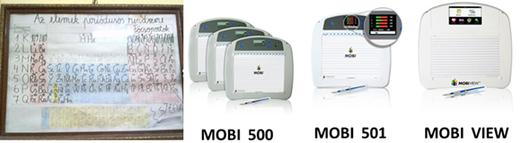

<b>Dr. habil Molnár György: </b>Egyetemi docens, a Műszaki Pedagógia Tanszék korábbi tanszékvezetője és a BME Tanárképző Központ korábbi főigazgatója. Villamosmérnök-mérnöktanár, orvosbiológus mérnök, a Neveléstudomány Doktora (PhD.) közoktatási vezető-szakvizsgázott pedagógus, számos tudományos és szakmai bizottság aktív tagja (OTDT, Tehetség Tanács, MAB, HERA, MPT, TKSZ). <a href="http://www.mpt.bme.hu/dr-molnar-gyorgy/">http://www.mpt.bme.hu/dr-molnar-gyorgy</a>

2001 óta a BME egyetemi oktatójaként folyamatosan részt vesz a Műszaki Pedagógiai Tanszék valamint a Gazdaság-és Társadalomtudományi Kar munkájában. Az IKT-alapú valamint élménypedagógiai jellegű kutatási alaptémái mellett a szakképzés-pedagógia módszertani és technológiai-innovációs lehetőségei is foglalkoztatták, melyek alkalmat adtak arra is, hogy az új korszerű, atipikus és elektronikus tanítási-tanulási utakat is kutathassa. Email/Ímél: <a href="mailto:molnar.gy@eik.bme.hu">molnar.gy@eik.bme.hu</a> 

Az immár 86 éves Műszaki Pedagógia Tanszékünk egy rendhagyó, játékos utazásra hívja a kedves érdeklődőket, melynek keretében modern környezetben, a műszaki tudományok magyar fellegvárában interaktív módon bemutatjuk az oktatásban használt oktatástechnikai eszközök öt generációját. emellett felvonultatjuk a nemzedékek generációit is, a veteránoktól kezdve a Z generációkig. A játékkal egybekötött rövid, érdekfeszítő előadások során a gyakorlatban prezentáljuk, hogyan jutott el az oktatás a hagyományos palatáblától a krétás táblán keresztül az okostábláig, a falitábláktól a számítógépig, a logarléctől a kiterjesztett vagy virtuális valóságig. Az eszközöket széles tárházának bemutatása mellett az egyes emberi generációk is megszólalnak, és kis történeteket mesélnek a különböző oktatástechnikai eszközhasználatukkal kapcsolatos élményeikről. Az esemény online résztvevői aktív szerepet játszhatnak a Kutatók Éjszakájának Műegyetemi műszaki és pedagógia jellegű programjában, ismereteiket, tudásukat ezáltal gyarapíthatják a résztvevők.

 

