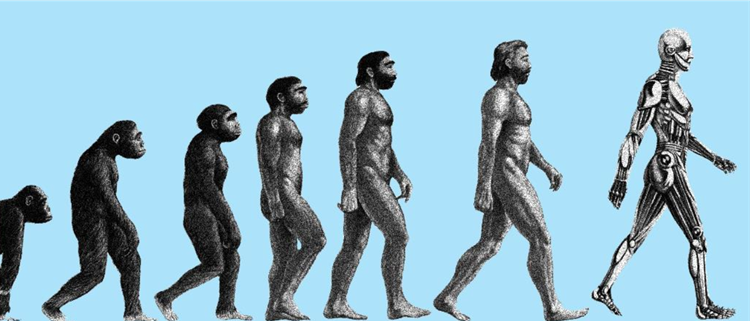

<b>Dr. Botzheim János: </b>Botzheim János műszaki informatikából szerzett MSc (2001) és PhD (2008) fokozatot a BME-n. Jelenleg a Mechatronika, Optika és Gépészeti Informatika Tanszék egyetemi docense. Számos tudományos egyesület tagja, pl. Neumann János Számítógép-tudományi Társaság, Magyar Mérnökakadémia, Magyar Fuzzy Társaság, IEEE. Kutatási területe a számítási intelligencia és a kognitív robotika.

<b>Gyöngyössy Natabara Máté: </b>2020-ban szerzett mechatronikai mérnöki Bsc fokozatot a BME-n. Jelenleg Msc hallgató és a Mechatronika, Optika és Gépészeti Informatika Tanszék kutatási asszisztense. Érdeklődési és kutatási területe a biológiailag inspirált mesterséges intelligencia.

Tudod mi az az optimalizáció? Netán hallottál arról is, hogy egy igen nagyszabású folyik már több millió éve?
Az élővilág számtalan stratégiát dolgozott ki a túlélés és fejlődés érdekében, melyek eredményeképpen a mai élővilág kialakulhatott. Ez a folyamat napjainkban is zajlik, úgy kicsiben, ahogy nagyban is. Előadásunk során egysejtűek és az állatvilág olyan trükkjeit mutatjuk be, melyeket a mérnöki gyakorlat átvett és nehezebb problémáinak megoldására használ. A párhuzamok áttekintése mellett egyszerű példák segítségével tekintjük át ezen módszerek alapjait, valamint ezek néhány ipari alkalmazását.

 
