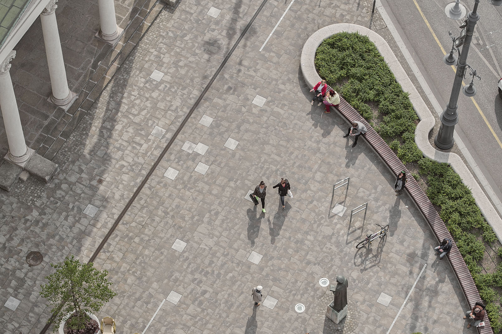

<b>Szabó Levente DLA építész: </b>tanszékvezető egyetemi tanár (BME Építészmérnöki Kar, Középülettervezési Tanszék)
Az előadó egyetemi oktató, építész, számos műemlékrekonstrukció és emlékműprojekt tervezésében vett részt. Kutatásában – szorosan összefonódva alkotói munkásságával – az építészet és emlékezet lehetséges kapcsolatait keresi. Házakat, köztereket tervez, egyetemen tanít, kutat, s mindeközben az építészet csodálatosan izgalmas, időben rétegzett, végtelenül gazdag világát igyekszik minél átfogóbban megismerni és megismertetni.

Hogyan hat az épített tér egyéni és kollektív emlékezetünkre? Mitől más egy emlékhely, ha építész tervezi? Hogy képes egymásra hatni az alkotás és a kutatás folyamata? Az előadás rövid betekintést enged e kérdéskörökbe, részben az előadó saját munkáin, részben más, izgalmas példákon keresztül.

 

