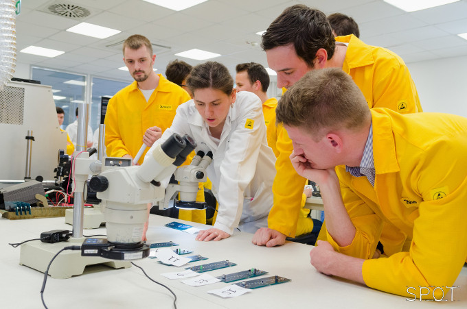

<b>Dr. Krammer Olivér: </b> Kutatását a felületszerelési technológiák forraszanyagainak és a forraszanyag felvitelének lépésének optimalizálására szenteli. Fő szakterületének, a látványos stencilnyomtatás folyamatának bemutatása a mikro-világtól egészen a kézzel fogható elektronikáig vezet. 2018 óta Bolyai János Kutatási Ösztöndíjas, 2018-ban, 2019-ben és 2020-ban elnyerte az Új Nemzeti Kiválóság Program Bolyai+ ösztöndíját.
 
<b>Dr. Géczy Attila: </b>Kutatását a felületszerelési technológiák speciális lépéseinek és alkalmazásának szenteli. Az általa kutatott gőzfázisú forrasztás a közeljövő egyik ígéretes ipari megoldása lehet. A módszer jól illeszkedik a bemutató programjába, kiegészítve alkalmazott szenzorikai demonstrációval. 2016–2018 Bolyai János Kutatási Ösztöndíjas, 2018-ban elnyerte az Új Nemzeti Kiválóság Program Bolyai+ ösztöndíját.
 
<b>Bátorfi Réka: </b>Tudományos segédmunkatárs, és PhD hallgató, aki kutatásában a forraszanyagok speciális mikroszkopikus hibajelenségeivel, a whiskerekkel (ón tűkristályok) foglalkozik. Alkalmazott mérnöki tapasztalata a teljes elektronikai gyártás lépéssorozataira kiterjed. Réka a tanszék nagykövete az egyetem Lányok Napja programsorozatában.
 
<b>Straubinger Dániel: </b>PhD hallgató, kutatási területe a felületszerelési technológia, azon belül is a gőzfázisú forrasztási technológia hőátadásának vizsgálata és a forraszkötésekkel kapcsolatosan kialakuló hibamechanizmusok. Ipari tapasztalata révén jártas a gyártósorokon gyakran felmerülő megoldandó nehézségek területén. 2020-ban elnyerte az Új Nemzeti Kiválóság Program ösztöndíját.

Mindnyájan használjuk az életünket ellepő elektronikai kütyüket, mobiltelefonokat, elektronikai eszközöket. Ám azt csak kevesen tudják, hogy milyen összetett lépéssorozaton keresztül készülnek el az eszközök lelkét képező áramköri szerelvények. A program során bemutatásra kerül az elektronikai ipar által széleskörűen használt felületszerelési technológia, az ehhez kapcsolódó technológiai lépések (pl. stencilnyomtatás) és berendezések. Az Elektronikai Technológia Tanszék laborkomplexumában az ipari megoldások és a kutatási lehetőségek egy érdekes, online eseményen érnek össze. A programban a jelenleg zajló aktív kutatási témákról is közérthető beszámolót nyújtanak a tématerületen dolgozó Bolyai+ ösztöndíjas tanszéki kutató kollégák.

 

