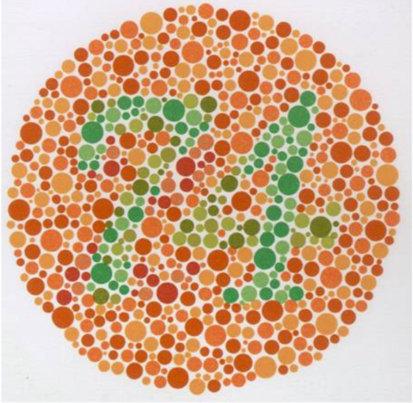

<b>Prof.dr.habil Ábrahám György, az MTA doktora: </b>Mechatronika, Optika és Gépészeti Informatika tanszékének alapító tanszékvezetője. 48 éves oktatói- kutatói munkássága során kiemelkedő tevékenységet végzett a színtévesztés színszűrős szemüvegekkel történő korrekciója, az optikai átviteli függvények méréstechnikája és nemzetközi űrprogramokban történő részvétele terén.

Az előadás az emberi színlátás fiziológiai alapjait, a színtévesztés típusait, és korrigálásának lehetőségeit mutatja be.

 

