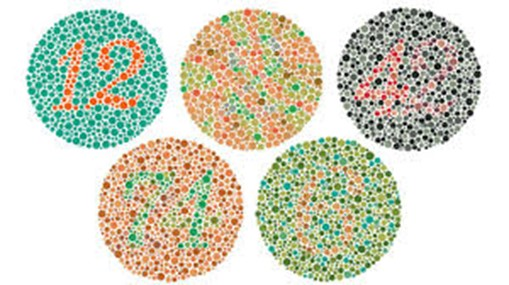

<b>Prof.dr.habil Ábrahám György, az MTA doktora: </b>Mechatronika, Optika és Gépészeti Informatika tanszékének alapító tanszékvezetője. 48 éves oktatói- kutatói munkássága során kiemelkedő tevékenységet végzett a színtévesztés színszűrős szemüvegekkel történő korrekciója, az optikai átviteli függvények méréstechnikája és nemzetközi űrprogramokban történő részvétele terén.

Az egyetem Mechatronika, Optika és Gépészeti Informatika Tanszékén kifejlesztették az emberi színtévesztés korrigálásának lehetőségét. Egy meghirdetett előadásban ismertetjük a korrekcióval kapcsolatos elméleti hátteret, de az előadás megnézése nélkül is el lehet végezni a vizsgálatot egy szoftver segítségével. A vizsgálat végén a szoftver megmondja a színtévesztés diagnózisát: a színtévesztés típusát és mértékét is. Célszerű, ha a színtévesztő megkér valakit, aki biztosan nem színtévesztő, hogy vele együtt vegyen részt a vizsgálaton, mert a szoftver az épszínlátó eredményei segítségével korrigálja a színtévesztő eredményeit, hogy a használt monitor beállításától ne függjön a diagnózis.

 

