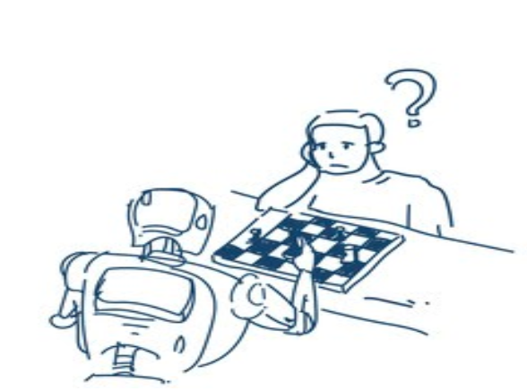

<b>Dr. Fatma Aslan:</b> A BME Gazdaság- és Társadalomtudományi Karán alakult Kvantitatív Társadalom- és Gazdaságtudományi Kutatóközpont posztdoktori kutatója. Közgazdasági doktori fokozatát 2019-ben, a párizsi CNAM-ban, és az isztambuli Bilgi Egyetemen szerezte Jean Lainé irányításával. Kutatási területe a szavazáselmélet, a társadalmi döntések elmélete, a párosításelmélet, a kooperatív játékelmélet, a kísérleti közgazdaságtan és a viselkedésgazdaságtan.

Participants will learn about some economic concepts by playing two different games. In these games, they will be asked to make decisions that mimic real-life economic scenarios. 

The first game will shed light on strategic thinking, and it relates to diverse phenomena like beauty contests and speculation on the stock market.
The second game will highlight the potential difficulties and issues arising when trying to cooperate and contribute towards a common goal. These aspects are important in real-life issues such as reaching climate agreements, collecting taxes, etc.

 
