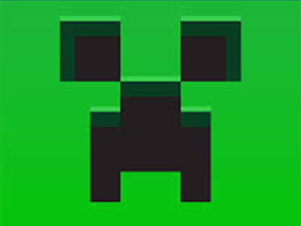

 
A természetben lépten-nyomon láthatjuk a töredezés eredményét: nagy testek kisebb, szögletes testekre esnek szét - sokszor ez kockaszerű formákat eredményez. De mennyire van ez így és miért? Ennek járt utána a Műegyetem kutatói által vezetett magyar-amerikai kutatócsoport.

