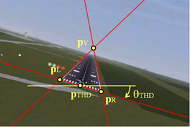
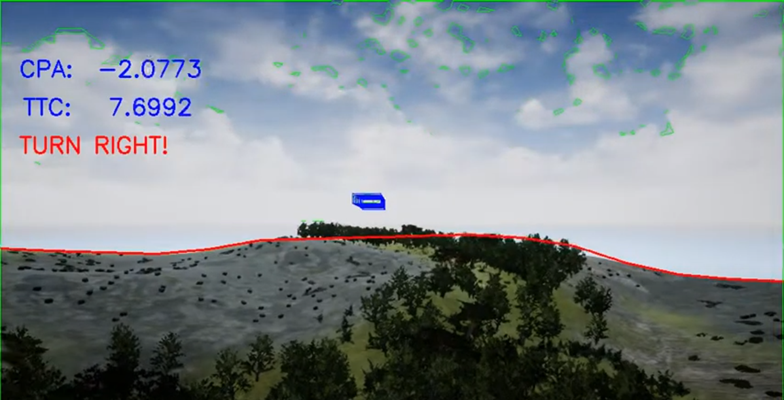

<b>Dr. Bauer Péter: </b>a BME Közlekedésmérnöki Karán végzett okleveles gépészmérnökként (repülőgépészként) 2005-ben. Ezt követően ott volt doktorandusz a Közlekedésautomatikai Tanszéken 2005 és 2008 között. Doktori (PhD) fokozatát a BME Közlekedésmérnöki és Járműmérnöki Karán szerezte meg 2013-ban. Jelenleg a BME Közlekedés- és Járműirányítási Tanszék tudományos munkatársa és az ELKH Számítástechnikai és Automatizálási Kutató Intézetének tudományos főmunkatársa. Fő kutatási területe az optikai szenzorok (kamerák) alkalmazása légieszközök (repülőgépek és helikopterek) látni és elkerülni és navigációt segítő rendszereiben. Ez kiegészül paraméter becslési és navigációs algoritmusok kutatásával, valamint légieszközök pályakövető szabályzásával. Több külföldi konferencián publikált cikkel rendelkezik, több hetet kutatott az USA-ban. 40 éves, nős. Hobbija a futás. Heti rendszerességgel a Nagytétényi Református Egyházközség tevékenységében vesz részt.

 
A kisebb méretű video kamerák megjelenésével anno lehetővé vált, hogy már a családoknak is legyen otthon kamerájuk emlékeik mozgókép formában való megörökítésére, ma pedig természetes dolog, hogy mindenki a zsebében hord egész nap egy kamerát és fényképezőgépet a telefonján. A kisméretű kamerák fejlődése mára lehetővé tette, hogy a közúti járműveken, a légieszközökön és még a kisméretű drónokon is alkalmazzák őket akár nagyobb mennyiségben nem csak felvételek rögzítésére, hanem biztonsági funkciók megvalósítására is!

Az előadás kifejezetten a járműveken alkalmazott, a közlekedés biztonságát növelő kamera alapú megoldásokra fog fókuszálni áttekintést adva az autókon és repülőkön (helikoptereken) már alkalmazott, vagy fejlesztés alatt levő rendszerekről lehetőleg videókkal illusztrálva a különféle megoldások működését. Ilyen rendszerek ma már rendelkezésre állnak az egyszerű parkoláshoz (tolató kamera) de akár a részlegesen önvezető autókhoz, az ipari felhasználású drónokhoz, vagy a leszállást végző Airbus repülőkhöz is! Az előadás második felében a BME Közlekedés- és Járműirányítási Tanszék és a SZTAKI pár kutatási témájába és ezek megoldandó kérdéseibe nyerhetnek majd a nézők betekintést.

<!--
 <table class="picture">
<tr>
<td>

  
Leszállópálya paramétereinek meghatározása kamera képből

  
Szemből érkező légieszköz paramétereinek becslése és döntés az elkerülésről

</td>
</tr>
</table>
-->

 

