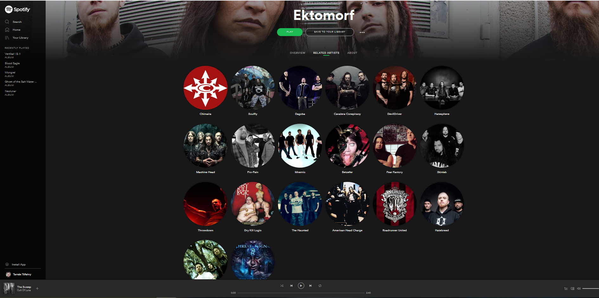

A digitális zeneiparban mindenki egyenlőbb, mint az offline világban, vagy ugyanúgy megjelennek a földrajzi és más egyenlőtlenségek a zenekarok közötti kapcsolatokban? Az előadásban magyar extrém metal zenekarok Spotify-profiljainak hálózatait elemezve azt mutatjuk be, hogyan termelhetik újra az egyenlőtlenségeket az új zenék felfedezésében meghatározó algoritmusok. A fő állításunk egyfelől az, hogy a zenekarok online ajánlórendszerben elfoglalt pozíciói és offline beágyazottságuk összefüggenek egymással. Azok a zenekarok, amelyek nemzetközi kiadói háttérrel rendelkeznek, nagyobb valószínűséggel rendelkeznek nemzetközi ajánlásokkal (azaz nemzetközi viszonzott kapcsolatokkal) a Spotify-on. A hazai kiadók által kiadott zenekarok ezzel szemben nagyobb valószínűséggel rendelkeznek csak magyar kapcsolatokkal. Emellett megfigyelhető, hogy míg a nemzetközi zenekarok ajánlásában a műfaji jelleg kerül előtérbe, addig a magyar zenekarokat elsősorban származási ország szerint csoportosítja, ajánlja a Spotify algoritmusa, ezzel újratermelve az offline világban létező földrajzi, kulturális elszigeteltségüket.

 
