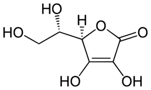

<b>Szarka András: </b>Szarka András az MTA doktora, a BME VBK egyetemi tanára, dékánhelyettese. 1998 óta foglalkozik C-vitamin kutatással, PhD fokozatát a Semmelweis Egyetem Molekuláris Orvostudományok Doktori Iskolájában szerezte 2003-ban, dolgozatában a C-vitamin fehérjék térszerkezet kialakításában betöltött szerepével foglalkozott. MTA doktori fokozatát 2017-ben védte meg Vízoldható antioxidánsok kéz a kézben: C-vitamin és Glutation címmel. Jelenleg Biokémiát, Patobiokémiát és Klinikai Kémiát tanít a BME. Vendégkutatóként C-vitamin transzporttal és anyagcserével foglalkozott

a Sienai, a Molise és az Antwerpeni Egyetemen. Számos nemzetközi folyóirat szerkesztőbizottsági tagja. Jelenleg a C-vitamin sejthalálban betöltött szerepét vizsgálja.

 Az on-line előadás keretében foglalkozunk a C-vitamin szervezetünkben betöltött szerepével, érintjük a napi igény problémáját, beszélünk a megadózisú adagolásról, esetleges szerepéről a fertőző betegségek, illetve tumor terápiájában.

 
