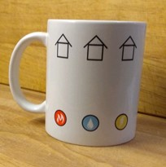

 
Miben hasonlít egy pohár a strandlabdára illetve egy bögre az úszógumira? Egy egyszerű fejtörőtől indulunk, aminek van is és nincs is megoldása... Aztán érdekes matematikai kirándulást teszünk a geometria, gráfelmélet, topológia világában, gyurmázunk, megismerjük a Császár-féle átlómentes testet, és kirándulásunk végére új értelmet nyer a pohár, strandlabda, bögre és úszógumi viszonya.

Az előadás követéséhez nincs szükség mély matematikai ismeretekre, azonban kitartó, logikus gondolkodásra igen!

