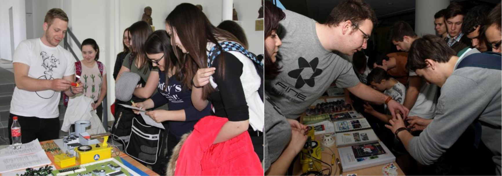

A csatorna 12:55-től elérhető, a fenti linkre kattintva telepíthető az applikáció illtve valósul meg a csatlakozás: 

<b>Meeting ID</b>: 963 3818 0913 
<b>Passcode</b>: 835612

<b>létszám limit</b>: 25 fő (rugalmas), regisztráció nem szükséges, életkori limit nincs.

<b>Szondy Borbála: </b>  MSc végzős energetikai mérnök szakon, FINE elnökségi tag, ért a fúziós és fissziós témákhoz is.

<b>Boguszlavszkij Gergely: </b> Végzett energetikai mérnök és okleveles fizikus, MNT FINE elnök, jártas mind a fisszióban és a fúzióban.

A FINE a Kutatók Éjszakáján minden érdeklődő korosztálynak igyekszik kielégíteni a kíváncsiságát. Az idei évben mi is igyekszünk az online térben megvalósítani programjainkat. Eddig papíralapú kvízeinket a különböző korosztálynak különböző kategóriákban online formában tesszük elérhetővé, melyet csoportokban tudunk átbeszélni. A kvízeket videókkal, animációkkal fogjuk illusztrálni.

A fiatalabb korosztályok körében a 3D- nyomtatott makettjeink igazán sikeresek. A makettek a jövőben épülő VVER-1200-es atomerőművi blokkok telephely és blokk konstrukcióját mutatják be. Az egyszerűsített makett szétszedhető elemeit összekeverve adtuk át az érdeklődő gyerekeknek, így a makett összerakása közben játszva tanulták meg az erőmű működésének és biztonsági filozófiájának alapelveit. Ezt online átadva és közben magyarázva lehet megérteni az atomerőmű felépítését. Emellett lehetőség szerint online legózást szeretnénk tartani, mely során egy atomerőművet építhetnek meg az érdeklődők.

