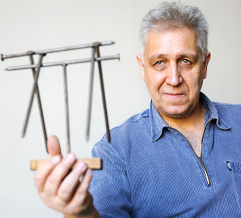

 <ul> 
<li><b>2020 November 27. 16:00 Semmi varázslat, csak fizika I.</b> (ütemezett élőközvetítés)
 
A fizika alaptudomány, amely nélkül a modern társadalom összeomlik. Ahogy eddig is, kiragadjuk a fizika legszerethetőbb részét a kísérletezést.
 
Helyszín: <a href="https://www.youtube.com/watch?v=fClVJP5R2qY">Az előadó youtube csatornája</a>
</li>
 

<li>
<b>November 27. 16:30 Otthoni kísérletek, csináld utánam!</b> (youtube premier)
 
Szívószálak, labdák, pénzérmék, tölcsér vagy WC-papír-tekercs: minden otthonban megtalálható. Nem is gondolnánk, hogy érdekfeszítő kísérletek eszközéül is szolgálhatnak. Vagyis az előadásban olyan kísérletek lesznek a főszereplők, amelyek otthon is elvégezhetőek.
 
Helyszín: <a href="https://www.youtube.com/watch?v=rU7_pHuAatc">Az előadó youtube csatornája</a>
</li>

 

<li>
<b>November 27. 19:00 Semmi varázslat, csak fizika II.</b> (ütemezett élőközvetítés)
 
Környezetszennyezés, energiaellátás, fenntartható fejlődés ezek korunk legfontosabb kihívásai. A természettudományok, ezen belül a fizika alapos ismerete adhat helyes választ, megoldást ak érédsekre és a problémákra.
 
Helyszín: <a href="https://www.youtube.com/watch?v=WFyKiHHp2dE">Az előadó youtube csatornája</a>
</li>

 

<li>
<b>November 28. 9:00 Otthoni kísérletek, csináld utánam!</b>
 
Szívószálak, labdák, pénzérmék, tölcsér vagy WC-papír-tekercs: minden otthonban megtalálható. Nem is gondolnánk, hogy érdekfeszítő kísérletek eszközéül is szolgálhatnak. Vagyis az előadásban olyan kísérletek lesznek a főszereplők, amelyek otthon is elvégezhetőek.
 
Helyszín: <a href="https://www.youtube.com/watch?v=rU7_pHuAatc">Az előadó youtube csatornája</a>
</li>

 

<li>
<b>November 28. 11:00 Semmi varázslat, csak fizika I.</b> (youtube premier)
 
A fizika alaptudomány, amely nélkül a modern társadalom összeomlik. Ahogy eddig is, kiragadjuk a fizika legszerethetőbb részét a kísérletezést.
 
Helyszín: <a href="https://www.youtube.com/watch?v=fClVJP5R2qY">Az előadó youtube csatornája</a>
</li>

 

<li>
<b>November 28. 15:00 Semmi varázslat, csak fizika II.</b> (youtube premier)
 
Környezetszennyezés, energiaellátás, fenntartható fejlődés ezek korunk legfontosabb kihívásai. A természettudományok, ezen belül a fizika alapos ismerete adhat helyes választ, megoldást ak érédsekre és a problémákra.
 
Helyszín: <a href="https://www.youtube.com/watch?v=WFyKiHHp2dE">Az előadó youtube csatornája</a>

</li>

</ul>

