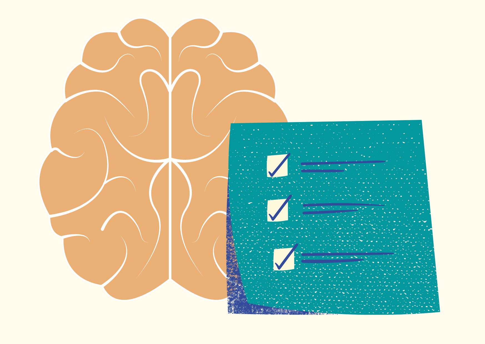

<b>Lencsés Anita és Mikula Bernadett: </b>Az előadók másodéves doktoranduszok a BME Kognitív Tudományi Tanszékének Neuropszichológia és Megismerés kutatócsoportjában. Érdeklődésük középpontjában az agysérülést követő emlékezeti és társas-érzelmi nehézségek állnak. Céljuk, hogy a kutatási eredményeik a klinikai neuropszichológiában is használhatóak legyenek a rehabilitáció során.

Mindannyiunkkal előfordul, hogy időnként elfelejtünk befizetni egy számlát, átadni egy üzenetet valakinek, vagy megjelenni egy találkozón. Ha az emlékezetünk működésére panaszkodunk, akkor általában az előbbi problémákra gondolunk. Az emlékezetünknek azt a részét, ami ilyenkor cserben hagy minket, prospektív memóriának hívjuk. Mitől függ a prospektív emlékezeti készségünk? Mit tehetünk, ha javítani szeretnénk rajta? Előadásunkban ezeket a kérdéseket igyekszünk megválaszolni. A Neuropszichológia és Megismerés Kutatócsoport vizsgálatain keresztül bemutatjuk továbbá a téma klinikai jelentőségét a szerzett agysérülések példáján.

 

