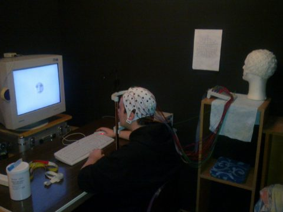

<b>Németh Kornél: </b> 2016-tól a BME Kognitív Tudományi Tanszékének munkatársa. Kutatási területe az arcfelismerés és annak zavarai. Munkája során elektrofiziológiai, viselkedéses és pszichofiziológiai módszereket alkalmaz.

Az emberek 2-2.5%-a nem, vagy nagyon rosszul ismer fel arcokat, a súlyosság eltérő, de bizonyos esetekben a közvetlen hozzátartozóikat, vagy egy fényképen önmagukat sem ismerik meg. Az elmúlt években több tanulmány próbált ennek a rosz teljesítménynek a korrekciójára valamilyen módszert találni, de egyelőre nem sikerült megtalálni a megfelelő eljárást. A kidolgozott módszerek a vizsgálati személyek egyik felének általában nem segített, vagy pedig a javító hatás nem volt hosszútávú. Az előadás központi témája ezen kérdések köré csoportosul, valamint bemutatjuk a saját fejlesztésű tréning programunkat, amivel az általunk tesztelt arcvakok 80%-ának jelentősen javítani tudtuk a felismerési teljesítményét.

 

