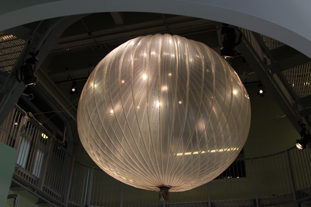

<b>Dr. Hegyi Dezső: </b>Építészmérnök, a BME Szilárdságtani és Tartószerkezeti Tanszékének vezetője. 2012-13-as tanévben vendégkutatóként a CALTECH (USA, Los Angeles) repülőmérnöki intézetében végzett kutatásokat a superpressure ballonokhoz használt LLDPE anyagok tönkremenetelével kapcsolatban.

<b>Dr. Gáspár Orsolya: </b>Építészmérnök, adjunktus a BME Szilárdságtani és Tartószerkezeti Karán. A ballonokról Hegyi Dezsőtől hallott először évekkel ezelőtt. A felállás változatlan, most is ő az, aki kérdez. 

<b>Karádi Dániel: </b>Doktorandusz hallgató a BME Szilárdságtani és Tartószerkezeti Tanszéken, a műszaki textíliák tönkremenetelét vizsgálja.

<b>Teams belépési kód</b>: lavkvge
 
Ha az űrtechnika szóba kerül, általában valami bonyolult dologra gondolunk – többnyire jogosan. Azonban (majdnem) az űrbe egészen egyszerű módszerrel is feljuttathatunk kísérleti berendezéseket – az úgynevezett magaslégköri ballonok a héliumos lufihoz hasonló elven működnek. Ezek képesek elérni a sztratoszférát (~30-40 km magasság), ahol már elvégezhetőek olyan vizsgálatok, amik például a kozmikus sugárzást figyelik.

Ha mindig is érdekelt, vajon mi a különbség a zero-és a superpressure ballonok között, ez a program neked szól. Ha kíváncsi vagy, hogyan lehet egy focipályányi méretű lufit a levegőbe emelni, akkor is.

Az előadást Dr. Hegyi Dezső, a BME Szilárdságtani és Tartószerkezeti Tanszékének (Építészmérnöki Kar) vezetője tartja, aki néhány éve a NASA egyik laborjában a magaslégköri ballonokhoz használt anyagokkal kapcsolatos kutatásban vett részt. Az előadás blokkot követően a résztvevőket egy rövid, kvízekkel tűzdelt kísérletsorozatra invitáljuk, ahol olyan világmegváltó kérdésekre keressük a választ, mint hogy hány héliumos lufi kell ahhoz, hogy egy túrórudit az űrbe (a levegőbe) juttassunk.

<b>Célcsoport</b>: Felsősök és gimnazisták.

 

