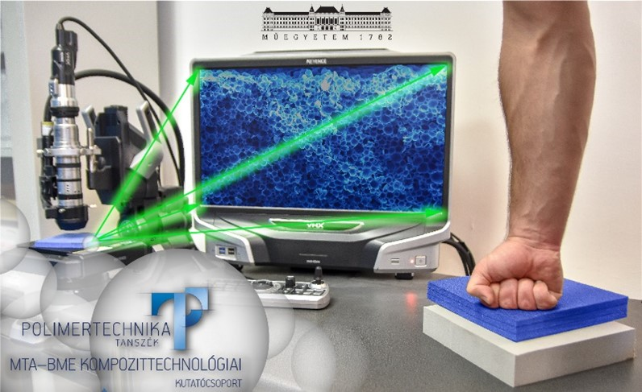

<b>Dr. Kmetty Ákos: </b>Tisztelettel köszöntöm Dr. Kmetty Ákos vagyok a Budapesti Műszaki és Gazdaságtudományi Egyetem, Gépészmérnöki Kar, Polimertechnika Tanszékén egyetemi docensként dolgozom. Fő kutatási területem a polimerből készített habszerkezetek fejlesztése, tulajdonságaik széleskörű vizsgálata az ipar számára is adaptálható eredmények feltárása. Fontosnak tartom az új és környezetbarát alapanyagok és belőlük készített termékek (pl. habok) fejlesztését és alkalmazását, amellyel újabb lépést tehetünk a körforgásos gazdaság megvalósítása felé, csökkentve ezzel például a rövid életciklusú termékek környezetterhelését.

 
A program során betekintést nyerhet a polimer habok alapanyagainak, gyártástechnológiáinak és vizsgálati módszereinek világába kutatói „szemüveg(ek)en” keresztül. Részletes információkkal gazdagodhat a megújuló erőforrás alapú és egyben biológiai úton (akár házi körülmények között) lebontható/komposztálható „bio” anyagokról és azok speciális mikro-méretű gyöngyökkel történő habosításáról, valamint tulajdonságairól (cellaszerkezet, ütéselnyelő képesség).

