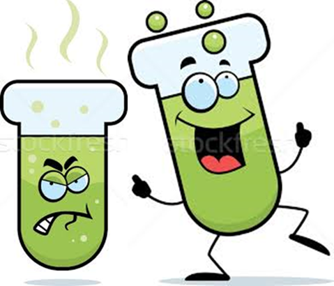

<b>Dr. Mika László Tamás: </b> Egyetemi tanár, tanszékvezető, vegyészmérnök oklevelét 2000-ben a Veszprémi Egyetemen, summa cum laude minősítésű Ph.D fokozatát 2010-ben az ELTE-n szerezte. 2012-től óta BME, VBK, Kémiai és Környezeti Folyamatmérnöki Tanszékének oktatója, a Katalitikus Eljárások Kutatócsoportot vezetője. Kutató évei során több külföldi intézményben (Forschungszentrum Karlsruhe, BayerMaterialScience Leverkusen, City University of Hong Kong) dolgozott vendégkutatóként.
Főbb kutatási területei a homogén katalízis, nagynyomású szintézisek és reakciómechanizmusok vizsgálata, katalizátor-tervezés valamint fázisegyensúlyok mérése és modellezése.

Mindennapi életünk szinte elképzelhetetlen a javaink jelentős részét előállító vegyipar nélkül. A világ növekvő energiaigénye mellett egyre több és több kémiai végterméket használ, a tüzelőanyagoktól kezdve, a műtrágyákon, polimereken át a gyógyszerekig és növényvédőszerekig. Más szóval nagyon nehezen találunk a környezetünkben olyan "dolgot", amiben ne lenne jelen fosszilis forrásból származó szénatom, és/vagy az adott termék az előállítása során ne esett volna át valamilyen kémiai átalakításon. Életünk tehát kémia, azaz vegyiparfüggő.

Ennek az óriási szektornak azonban jelentős a környezetre gyakorolt hatása, melynek mérséklése és a vegyipar biztonságosabb működésére érdekében született meg a zöld kémia koncepciója.

Az előadás során a zöld kémia szemüvegén keresztül betekintést nyerhetünk a vegyipari termelés kulisszáiba a grammos tételben előállított gyógyszerhatóanyagoktól kezdve a millió tonnás petrolkémiai termelésig.

 

