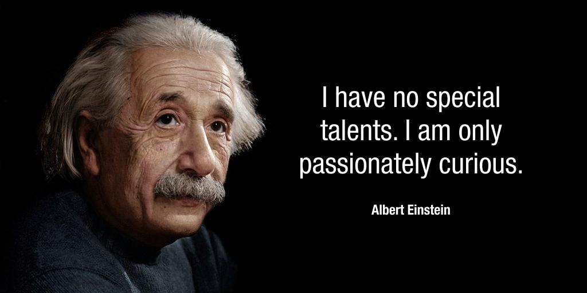

<b>Reichardt Richárd: </b>A BME Pszichológia Doktori Iskola hallgatója, a Budapest Sleeplab munkatársa. Kutatási témája az új ismeretek elsajátításának kognitív mechanizmusai. Szabadidejében az agykutatás teljes spektrumának eredményeit próbálja közérthetően kommunikálni (<a href="https://agykutatasegyszeruen.org/">https://agykutatasegyszeruen.org/</a>).

Az embert az ismeretek generációról generációra történő átadása emelte ki az állatvilágból. Az ifjú titánoknak nem kellett minden fortélyt újra és újra feltalálni, egymást tanítva sajátították el a túlélést segítő trükköket. Az ember életében ma sem kevésbé hangsúlyos az ismeretek átadása, sőt, ha lehet, a modernizáció során csak még fontosabbá vált ez a folyamat. Éppen ezért fontos az a kérdés, hogy mi teheti még hatékonyabbá a tanulást, tanítást? Sok szakértő szerint a kíváncsiság lehet ez a csodafegyver. Az előadásban a kíváncsiságról, és a kíváncsiság kognitív idegtudományi vizsgálatának módszereiről hallhatnak az érdeklődők.

