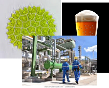

<b>Dr. Németh Áron: </b>Docens, munkáját a jogelőd Mezőgazdasági Kémiai Technológia Tanszéken kezdte. 2002-ben végzett biomérnöként Alkalmazott Biotechnológia Szakirányon, majd 2008-ban szerzett PhD fokozatot summa cum laude minősítéssel. Enzimes és mikrobiális technológiák fejlesztése, modellezése és léptéknövelése a fő kutatási és oktatási területe. 5éve vezeti a Fermentációs Félüzemi Kutató csoportot.

<b>Nagy Balázs József: </b>BSc alapképzését biológusként az ELTE-n szerezte, majd MSc mester tanulmányait a Műszaki Egyetemen folytatta alkalmazott biotechnológia szakirányon. A PhD doktori képzést 2017-ben kezdte. Mindösszesen 4 éve vizsgálja az F-laborban a mikroalgák különféle, ipari léptékben is megvalósítható tenyésztéstechnológiáját. Fő érdeklődési körei a mikroalgák mezőgazdasági hasznosíthatósága és a szennyvíztisztításban való alkalmazhatóságuk vizsgálata. Ezenfelül számos algaeredetű biotermék (tápláláékkiegészítők és kozmetikumok alapanyagai) előállításával és kinyerésével is foglalkozik.

A laborlátogatás 1 rövid előadásból és a Kísérleti üzem virtuális körbejárásából, valamint egy kísérleti üzemi fermentor kipróblásából (szabályzás, mintavétel, mikroszkópozás) áll. 

A látogatás során bemutatjuk, hogy az alaptudományok (kémia, biokémia, biológia) folymatai és jelenségei hogyan befolyásolják a termelő biotechnológiai folyamatokat. Milyen szabályozástechnikai trükkökel lehet például rávenni a hétköznapi élesztőt, hogy alkohol helyett biomasszát termeljen vagy egy algát, hogy a napfény helyett ecetet egyen.

 
