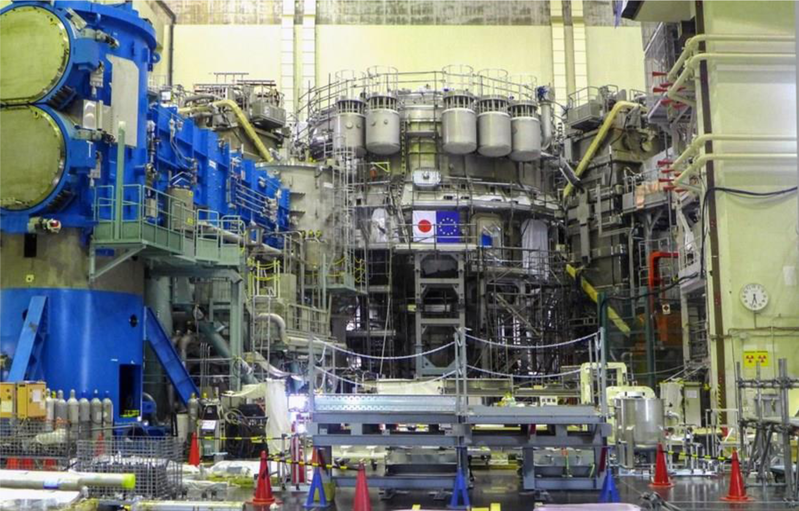

A csatorna 12:55-től elérhető, a fenti linkre kattintva telepíthető az applikáció illtve valósul meg a csatlakozás: 

<b>Meeting ID</b>: 935 0632 0239 
<b>Passcode</b>: 761620

<b>létszám limit</b>: Életkori limit nincs, de főleg a középiskolás korosztálynak szól az előadás.

<b>Kovácsik Ákos: </b> Egyetemi docens, a BME Fúziós Plazmafizika Csoport vezetője, a tokamakok nagy barátja.

A fúziós plazmafizikai kutatásokban a fizikusok mellett komoly feladatok várnak a mérnökökre is. Az anyagtudomány, a különleges gyártástechnológiák, a nagy sebességű optikai képfeldolgozás, a vákuumtechnika, a hatalmas erőket generáló mágneses tér, és az ionizáló sugárzások olyan feladatok elé állítják a mérnököket, amelyek megoldása kreativitást, és pontos szakmai ismereteket kíván. Ahhoz, hogy a fizikusok a megfelelő méréseket el tudják végezni, szükség van olyan berendezésekre, amelyek az imént felsorolt tényezők figyelembevételével készültek. Szeretném bemutatni mit is jelent a berendezésben alkalmazott vákuum, hogyan lehet ezt előállítani. Milyen szempontokat kell figyelembe venni a tervezés során, milyen anyagokat lehet használni, milyen megoldások kerülendők. Továbbá szeretném bemutatni milyen előkelő helyen van a magyar tudomány, és a magyar fejlesztések a világ élvonalában, mire lehet használni egy gyorskamerát, mi is egyáltalán a gyorskamera, és hogyan fogja egy magyarok által tervezett berendezés figyelni a világ jelenlegi legnagyobb plazmafizikai berendezését.

