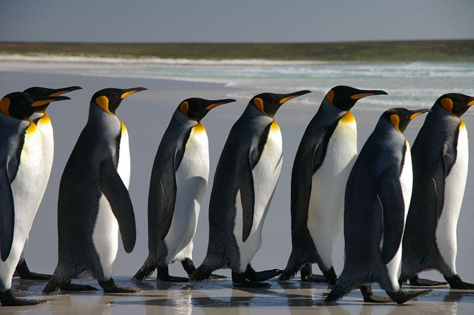

<b>Polner Bertalan: </b> pszichológus, a BME Kognitív Tudományi Tanszék adjunktusa. Fő kutatási témája az egyéni különbségek és a pszichózis-spektrum, mostanában a kognitív eltéréseket és az alvással való összefüggéseket vizsgálja. Érdekli még az is, hogy hogyan tudunk rugalmasan alkalmazkodni a változó környezetekhez.

Alapvető megismerési képességeink közösek – többségünk idegrendszere hasonló alapelvek mentén biztosítja, hogy például képesek legyünk észlelni a környezetünket, emlékezni korábbi tapasztalatainkra és azokat felhasználva döntéseket hozni és mozogni a világban. Mégsem vagyunk egyformák! Az elmeműködés részleteiben jelentős eltérések lehetnek köztünk, illetve akár egy héten belül saját magunkhoz képest is ingadozhat, hogy mondjuk mennyire tudunk éppen koncentrálni vagy uralkodni az érzelmeinken. Ezek az eltérések több szempontból is fontosak: gazdagíthatják közösségeinket és a lelki egészséggel is összefügghetnek. Az előadásban arról is beszélek majd, hogy hogyan foglalkozunk ezekkel a kérdésekkel a BME/Nyírő-OPAI Klinikai Idegtudomány Kutatócsoportban. 

 

