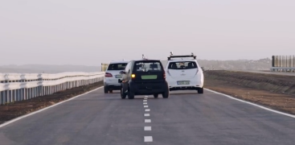

<b>Dr. Németh Balázs: </b>A BME Közlekedés- és Járműirányítási Tanszékének címzetes egyetemi docense, oktatási és kutatási területe az önvezető járművek irányítórendszereinek tervezési kérdései. Mérnöki-kutatói hivatása mellett egyben református lelkész. Személyes motivációja a terület kapcsán választ találni a kérdésekre, hogyan lehet képes egy önvezető algoritmus figyelembe venni hatékonyan a közlekedési rendszer minden emberi szereplőjét, milyen megbízhatósági garanciákat képesek nyújtani a gépi tanulásra épülő algoritmusok, valamint hogyan lehetséges etikai szempontokat beépíteni az önvezető járműrendszerek döntéshozási folyamataiba.

Az előadás célja az önvezető járművekben alkalmazandó, mesterséges intelligenciára épülő irányítási algoritmusok megbízhatósági kérdéseinek vizsgálata. Az előadás hangsúlya annak az aktuális kérdéskörnek a vizsgálata, hogy az MI-re épülő rendszerek beépítése mennyire ad megoldást, illetve garantáltan jó megoldást az aktuális járműirányítási problémákra.

 

