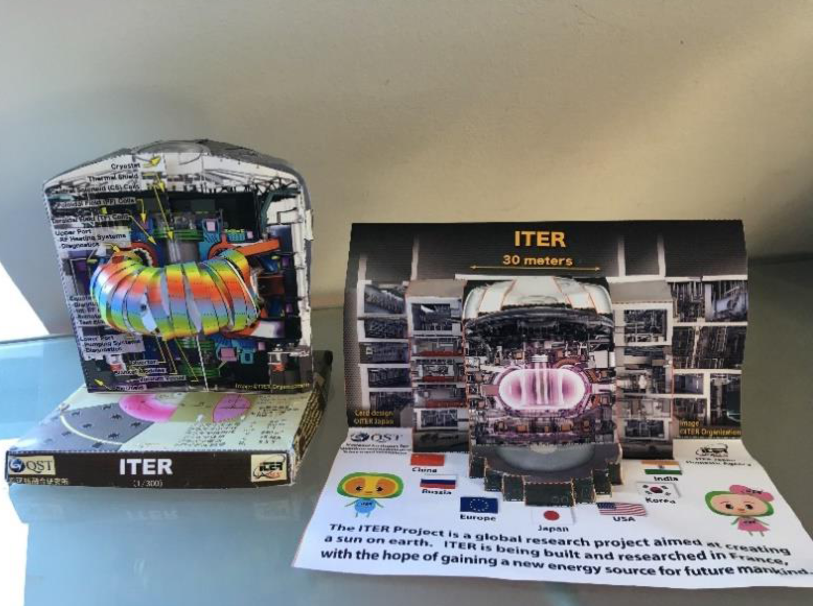

A csatorna 17:55-től elérhető, a fenti linkre kattintva telepíthető az applikáció illtve valósul meg a csatlakozás: 

<b>Meeting ID</b>: 968 2673 5882 
<b>Passcode</b>: 362957

<b>létszám limit</b>: Életkori limit nincs.

<b>Dr. Pokol Gergő: </b> Egyetemi docens, a BME Fúziós Plazmafizika Csoport vezetője, a tokamakok nagy barátja.

A magfúzió jelensége a kiapadhatatlan, tiszta energiaforrás ígéretét hordozza. A folyamat hasznosításához szükséges extrém körülményeket tokamak berendezésekben tudjuk létrehozni. Tokamakot építeni pedig egyszerű: papírból már 4 éves kortól meg lehet próbálni! Idősebbek próbálkozhatnak a japán origami tokamakkal is. Munka közben pedig megtanuljuk, hogy miért néz úgy ki a tokamak, ahogy kinéz, és hogyan működik. A tokamaképítés távmunkában zajlik: a maketteket a program megosztott mappájából (<a href="https://drive.google.com/drive/folders/1x-x-DH4_YP4FwmTqYjgjM38ITYBqvIBi?usp=sharing">https://drive.google.com/drive/folders/1x-x-DH4_YP4FwmTqYjgjM38ITYBqvIBi?usp=sharing</a>) lehet letölteni, és otthon kinyomtatni. Az egyszerűbb makettek építéséhez ollóra és papírragasztóra lesz szükség. A bonyolultabb ITER makettet érdemes tapétavágó késsel vágni vonalzó mellett egy ellenálló felületen, viszont cserébe nem kell ragasztani. Az elkészült munkákról készült fényképeket be lehet nevezni egy tokamak szépségversenyre. Ehhez egy fényképet kérünk a következő címre elküldeni: <a href="mailto:papir.tokamak@gmail.com">papir.tokamak@gmail.com</a> A fénykép beküldésével a nevező hozzájárul, hogy a beküldött fénykép megjelenjen a Magyar Nukleáris Társaság Fúziós Szakcsoportja és a magyar fúziós kutatói közösség által üzemeltetett magfuzio.hu honlapon és kapcsolt multimédia felületein. A levélben kérjük megjelölni, hogy a makett készítőjéről milyen információ jelenhet meg (név, életkor, lakóhely város szinten)! 

