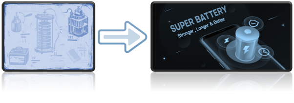

<b>Dr. Kun Róbert: </b>Az energiatárolás napjainkra és a jövőben is egyre hangsúlyosabb és fontosabb szerephez jut, gondoljunk csak a mobil eszközeinkre vagy az elektromobilitásra. Az előadásban bemutatjuk az elektrokémiai energiatároló rendszerek, köznapi szóhasználatban az „elemek” és „akkumulátorok”, alapvető működési elvét, különös tekintettel a Li-ion akkumulátorokra. A hallgatóság megismerheti a Li-ion akkumulátorok fejlesztési irányait és bemutatjuk az újgenerációs, szilárdtest akkumulátorok legfontosabb tulajdonságait és az azokat felépítő funkcionális komponenseket. Az előadás során példákat láthatunk az ún. poszt-Li-ion akkumulátorokkal kapcsolatban is.

 
