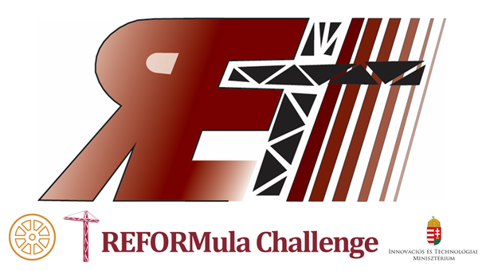

<b>Dr. Németh Balázs: </b>A BME Közlekedés- és Járműirányítási Tanszékének címzetes egyetemi docense, oktatási és kutatási területe az önvezető járművek irányítórendszereinek tervezési kérdései. Mérnöki-kutatói hivatása mellett egyben református lelkész. Személyes motivációja a terület kapcsán választ találni a kérdésekre, hogyan lehet képes egy önvezető algoritmus figyelembe venni hatékonyan a közlekedési rendszer minden emberi szereplőjét, milyen megbízhatósági garanciákat képesek nyújtani a gépi tanulásra épülő algoritmusok, valamint hogyan lehetséges etikai szempontokat beépíteni az önvezető járműrendszerek döntéshozási folyamataiba.

A REFORMula Challenge versenyen diák csapatok mérik össze vezetési és programozási tudásukat a kiterjesztett valóságban zajló versenyen. A program különlegessége, hogy a valós járművek ugyanolyan, de nem ugyanazon pályán versenyeznek – a járművek mozgását egy kamera-mobilapplikáció rendszer képezi le egyetlen pályán történő versennyé, ahol már a virtuális önvezető járművek is ringbe szállnak a győzelemért! A facebook.com/mernokmisszio oldalon élőben közvetített programnak a versenyen kívül része a technikai háttér és a Mérnökmisszió szervezésében, a BME Közlekedésmérnöki és Járműmérnöki Kar partnerségével megvalósuló REFORMula Challenge versenysorozat hátterének bemutatása.

 

