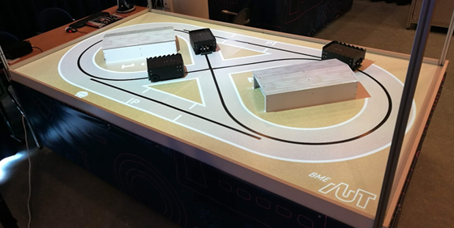
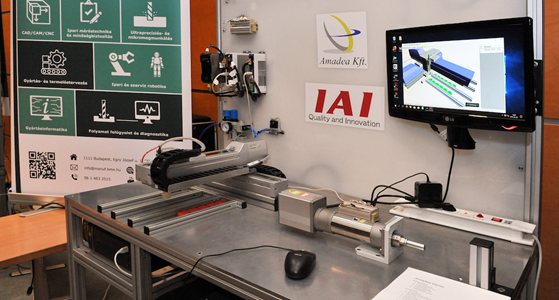
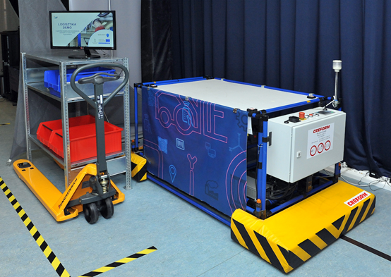

<b>Kovács László: </b>1990-ben végzett a BME-n villamosmérnökként, majd 2006-ban szerzett MBA diplomát szintén a BME-n. Szakmai pályafutását a Videotonban kezdte fejlesztőmérnökként, majd a HP tanácsadói csapatába került. 8 évet dolgozott a mobil távközlésben, ebből 4 évet informatikai igazgatóként. Az utóbbi években tanácsadóként, projektvezetőként tevékenykedett hazai és EU-s IT fejlesztési projekteken. Már több éve foglalkozik IoT fejlesztésekkel, ipar 4.0 megoldásokkal. 2018 Március óta a BME Ipar4.0 Technológiai Központ vezetője.

 
Az Ipar 4.0 Technológiai Központban megismerkedhetnek az Ipar 4.0 fogalmával, betekintést kapnak ipari digitalizációs megoldásokról.

A virtuális látogatás során Ipar 4.0-ás interaktív szcenárión mutatjuk be a különféle technológiák működését. A látogatóknak bemutatjuk többek között a VR és AR ipari alkalmazásait, megismerkedhetnek a 3D nyomtatással. Találkozhatnak ipari robotokkal, önvezető járművekkel, megvizsgálhatják az ipari szenzorok működését. Bepillantást nyerhetnek a „Big Data” megoldásokba, az öntanuló algoritmusok és mesterséges intelligencia világába. Láthatnak digitális ikerpárokat, digitális gyártás tervezést és sok más érdekességet – mindezt működés közben.

A bemutatókat próbáljuk interaktívvá tenni azáltal, hogy az előadás közben is chaten kérdéseket tehetnek fel előadóinknak.

<b>Program</b>

<b>Online bejelentkezés:</b>

<b>2020.11.27 péntek, 16:00 – 17:30	</b>
<ul>
<li>
Élő bejelentkezés a BME ipar4.0 Technológiai Központból. 
(<a href="https://kutatokejszakaja.hu/latogato/#/regisztracio">Regisztráció</a> szükséges)
 
A közvetítés az alábbi linken érhető el: <a href="https://youtu.be/e36RFcuGYpI">Youtube élő közvetítés</a>
</li>
<ul>
<li>Megnyitó</li>
<li>BME ipar 4.0 Technológiai Központ bemutatása</li>
<li>Kérdések-válaszok</li>
<li>Vitruális túra a TK-ban</li>
</ul>
</ul>
<b>Folyamatosan megtekinthető bemutatók:</b>

<ul>
<li>Ipar 4.0 Technológiai Központ a Műegyetemen (6:46)
Kovács László, Központvezető 
<a href="https://youtu.be/8wxi27S1iV8">Youtube video</a>
</li>

<ul>
<li>Kik vagyunk mi?</li>
<li>Mit is jelent az ipar4?</li>
<li>Mire jó az ipar4?</li>
<li>Szolgáltatásaink</li>
</ul>

<li>
Szcenárió1: Szenzorok, digitális ikerpár (6:19)
<a href="https://youtu.be/stK-7MxMFdA">Youtube video</a>
</li>

<ul>
<li>Ipari szenzorok</li>
<li>Egyszerű szenzorok, mikrokontrollerek</li>
<li>Digitális ikerpár</li>
</ul>

<li>
Szcenárió2: Digitális gyártervezés, gyártásütemezés és vezérlés (5:52)
<a href="https://youtu.be/f1bOqztKG4w">Youtube video</a>
</li>

<ul>
<li>ERP, MES integráció</li>
<li>Digitális gyártás és termeléstervezés</li>
<li>Virtuális valóság</li>
<li>Virtuális beüzemelés</li>
<li>Dinamikus energetikai szimuláció</li>
</ul>

<li>Szcenárió3: Adatgyűjtés, adatelemzés, adatvizualizáció (7:00)
<a href="https://youtu.be/vqV4kiR2HF0">Youtube video</a>
</li>

<ul>
<li>Ipar 4.0 zero point</li>
<li>Gyártási cella monitorozás és vezérlés</li>
<li>Gyári infrastruktúra felügyelet</li>
<li>IoT keretrendszer, kiterjesztett valóság</li>
<li>Cloudera-Dell-Reach ipar 4.0 referencia architektúra</li>
</ul>

<li>
Szcenárió4: Ipar4.0 gyártás, beavatkozás a termelésbe (5:27)
<a href="https://youtu.be/IBy5fSfTqrU">Youtube video</a>
</li>

<ul>
<li>01 Ipari robot</li>
<li>02 3D nyomtatás</li>
<li>03 Okos üvegház</li>
<li>04 Termelési folyamat vezérlés</li>
<li>05 Távfelügyelet. Sűrített levegő, mint szolgáltatás</li>
</ul>

<li>
Szcenárió5: Ipar 4 a logisztikában (5:39)
<a href="https://youtu.be/Tc3X7SAab6I">Youtube video</a>
</li>

<ul>
<li>01 Logisztika / AGV UWB helymeghatározás</li>
<li>02 Autonóm szállító járművek</li>
<li>03 Egyedi termékazonosítás, e-szállítólevél</li>
<li>04 Beltéri helymeghatározás IRID-RTLS technológiával</li>
</ul>

</ul>

 

 

 

