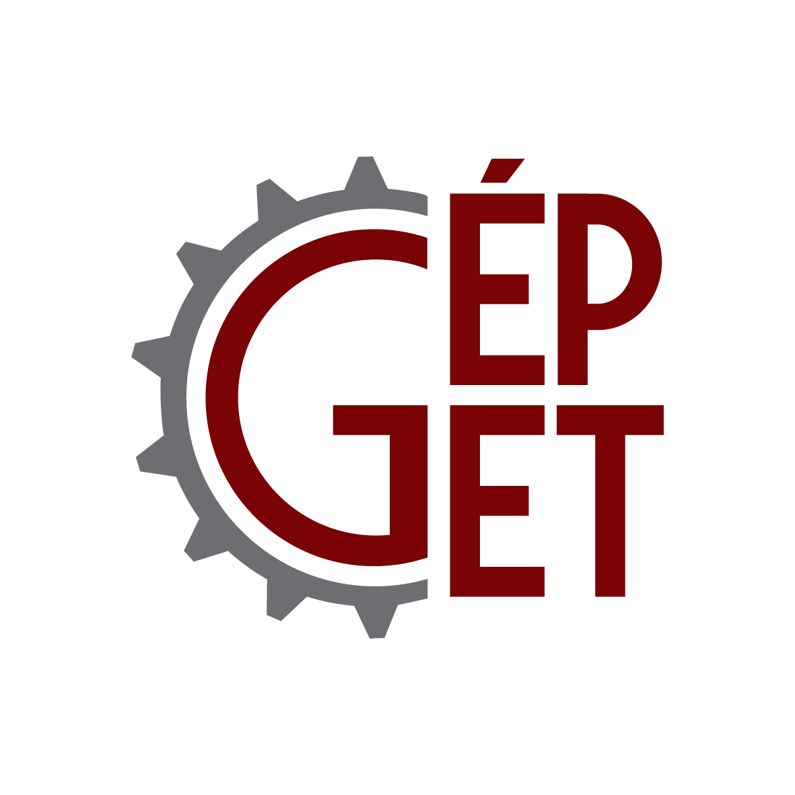

<b><a href="https://epget.bme.hu/oktatoi_oldal.php?lepes=4&oid=140" target="_blank">Dr. Szánthó Zoltán</a></b> 
 
<b><a href="https://epget.bme.hu/oktatoi_oldal.php?lepes=4&oid=118;" target="_blank">Dr. Hégely László</a></b>
 
<b><a href="https://epget.bme.hu/oktatoi_oldal.php?lepes=4&oid=148;" target="_blank">Dr. Deme Bélafi Zsófia</a></b>
 
<b><a href="https://epget.bme.hu/oktatoi_oldal.php?lepes=4&oid=112;" target="_blank">Dr. Czétány László</a></b>
 
<b><a href="https://epget.bme.hu/oktatoi_oldal.php?lepes=4&oid=110;" target="_blank">Dr. Both Balázs</a></b>
 
<b><a href="https://epget.bme.hu/oktatoi_oldal.php?lepes=4&oid=143;" target="_blank">Varjú Evelin</a></b>
 
<b><a href="https://epget.bme.hu/oktatoi_oldal.php?lepes=4&oid=115" target="_blank">Érces Norbert</a></b>
  
A BME Épületgépészeti és Gépészeti Eljárástechnika Tanszék Stokes Laborjában található kísérleti berendezések bemutatása a helyszínen és online bemutatók formájában.      
  

