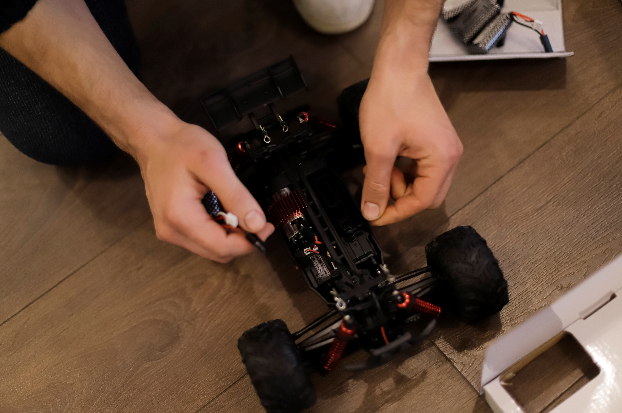

<b>Dr. Németh Balázs: </b>A BME Közlekedés- és Járműirányítási Tanszékének címzetes egyetemi docense, oktatási és kutatási területe az önvezető járművek irányítórendszereinek tervezési kérdései. Mérnöki-kutatói hivatása mellett egyben református lelkész. Személyes motivációja a terület kapcsán választ találni a kérdésekre, hogyan lehet képes egy önvezető algoritmus figyelembe venni hatékonyan a közlekedési rendszer minden emberi szereplőjét, milyen megbízhatósági garanciákat képesek nyújtani a gépi tanulásra épülő algoritmusok, valamint hogyan lehetséges etikai szempontokat beépíteni az önvezető járműrendszerek döntéshozási folyamataiba.

A REFORMula Challenge – Református Középiskolások és Egyetemisták Innovációs Versenyét a 2021/2022-es tanévben második alkalommal hirdeti meg a Mérnökmisszió a BME Közlekedésmérnöki és Járműmérnöki Karának szakmai támogatásával. A verseny alapeleme a kiterjesztett valóság, ahol egy térben versenyeznek egymással valós és virtuális kisautók – illetve virtuális drónok zenére táncolnak. A program fő eleme a versenyt és a kiterjesztett valóság technikai hátterét bemutató előadás, egy bemutató versenybe pedig a helyszínen becsatlakozhatnak a résztvevők.

 

