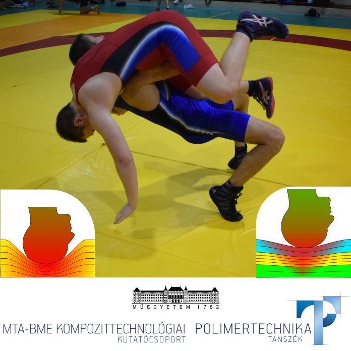

<b><a href="http://www.pt.bme.hu/munkatarsadatlap.php?id=7x3675Aez5z3f5gAtggAf72wj64zf334zu3A2r62&l=m" target="_blank">Dr. Kmetty Ákos</a></b>
 
<b><a href="http://www.pt.bme.hu/munkatarsadatlap.php?id=n9b29A5n7f39xh3wuhA8bB669j96bB4z674439t9&l=m" target="_blank">Litauszki Katalin</a></b>
 
<b><a href="http://www.pt.bme.hu/munkatarsadatlap.php?id=5d6q84jc5cbz83n5s2er385v647s56o44n57mg46&l=m" target="_blank">Tomin Márton</a></b>
 
<b><a href="http://www.pt.bme.hu/munkatarsadatlap.php?id=tu5rpc66x338w84e8j6xsf2yA84z2k654st84n73&l=m" target="_blank">Tábi Tamás</a></b>
 
<b><a href="http://www.pt.bme.hu/munkatarsadatlap.php?id=j2j3e454q78eqxmsstuvb3639ho6B799bpp6kbh9&l=m" target="_blank">Kovács Norbert Krisztián</a></b>
  
A résztvevők betekinthetnek a műanyag habanyagok mikro és makro világába. Megismerkedhetnek a porózus anyagokkal és azok dinamikus igénybevételre adott válaszával. A program során külön hangsúlyt fektetünk az egyes sportágakban (pl. küzdősportok) előforduló behatásokra és a műanyag habanyagok energiaelnyelő képességére, mérésére.   
  
 

