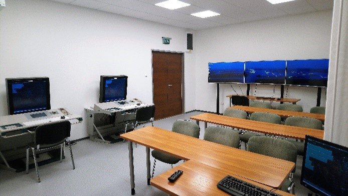

<b>Gál István:</b> A Repüléstudományi és Hajózási Tanszék tanársegédje
  
A HungaroControl Zrt. támogatásával létrehozott laboratóriumban a légiforgalmi irányításhoz kapcsolódó oktatási és kutatási tevékenységeket mutatjuk be. Ezek jelenleg a virtuális torony technológiára, a kiterjesztett valóságot alkalmazó megoldásokra és a munkaterhelés mérésének lehetőségeire összpontosítanak.
A laboratórium egyéb kutatási projektekben is részt vesz, ezekről is beszélünk a bemutatón.
  
 

