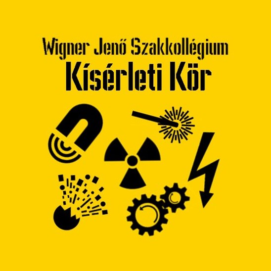

<b>Szász Bence:</b> Sziasztok, Szász Bence vagyok, én vagyok a Kísérleti kör vezetője a Wigner Jenő Szakkolégiumnak. Remélem sajátkészítésű és tervezéső eszközeinkel és kísérleteinkel minnél több emberrel sikerül megszerettetnünk a természettudományokat és hogy valami maradandó élményt tudunk nekik okozni. 
   
<a href="https://www.facebook.com/WjSzKiserletiKor" target="_blank">Facebook</a>
  
Különböző fizikai jelenségek szemléltetése tagjaink álltal készített eszközökkel
  
 

