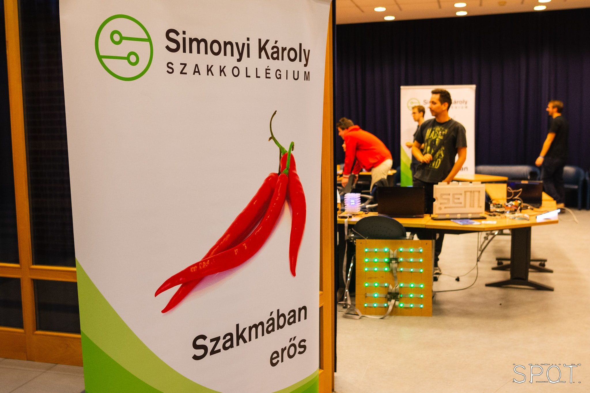

<b> Weisz Pál: </b> Negyedéves villamosmérnök hallgató vagyok, a Simonyi Károly Szakkolégium elnöke. Fontosnak tartom a fiatalok érdeklődését táplálni a műszaki- és természettudományok iránt.  

<b> A Simonyi Károly Szakkollégium öntevékeny körei: </b>
A Simonyi Károly Szakkollégium egy hallgatói szakmai szervezet, amely a BME Villamosmérnöki és Informatikai Karán működik. A szakkollégium 2003-ban vette fel Simonyi Károly, a Kar rajongva tisztelt professzora nevét. A Simonyi Károly Szakkollégium célja, hogy elsősorban a szakkollégium tagjai, lehetőség szerint a Villamosmérnöki és Informatikai Kar minden hallgatója számára lehetőséget biztosítson az egyetemi képzést kiegészítő ismeretek elsajátítására. Ennek érdekében tanfolyamokat, bemutatókat, konferenciákat és más szakmai rendezvényeket szervez, lehetőségéhez mérten infrastruktúrával támogatja a hallgatók önálló szakmai munkáit. Ezenkívül a szakkollégium céljai közé tartozik, hogy a tagjai által elért eredményeket minél szélesebb körben publikálja, a magyar felsőoktatás más egységeivel és a szakemberekkel megismertesse a szakkollégiumban folyó munkát.
  
A látogatók megismerhetik a hallgatói szakmai életet és az ez által előállított robotikai, elektronikai és informatikai érdekességeket. Emellett kipróbálhatják magukat ügyességi és agytornász játékokban is, mellyel versenyezhetnek a többi látogatóval.

 

 

