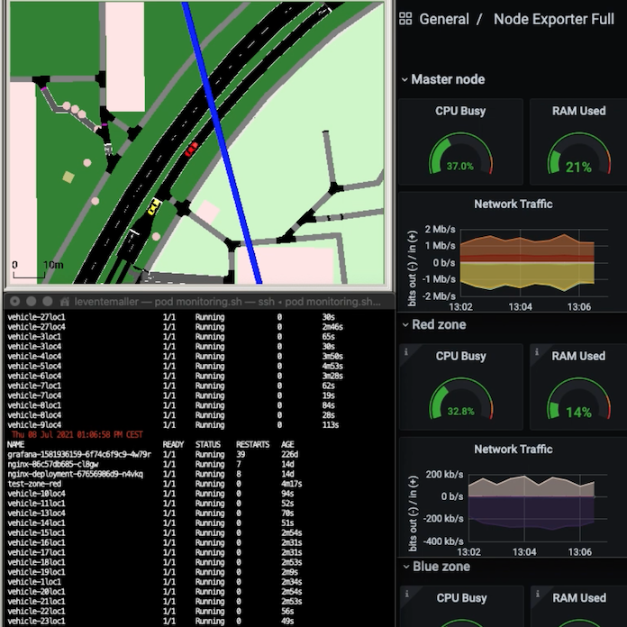

<b>Dr. Bokor László:</b> egyetemi docens, kutatócsoport vezető, BME HIT, <a href="https://medianets.hu/munkatarsak/bokor-laszlo/" target="_blank">https://medianets.hu/munkatarsak/bokor-laszlo/</a>
  
<b>Maller Levente:</b> MSc hallgató, BME HIT
  
<b>Suskovics Péter:</b> Innovációs főmunkatárs
  
Hogyan beszélgetnek majd egymással a jövő okos autói és közben mi történik az 5G hálózatok szövevényes felhőiben? A holnap kérdései, melyekre a BME és az Ericsson autóipari használati esetek vizsgálatával mutatja be a lehetséges válaszokat.
  
 

