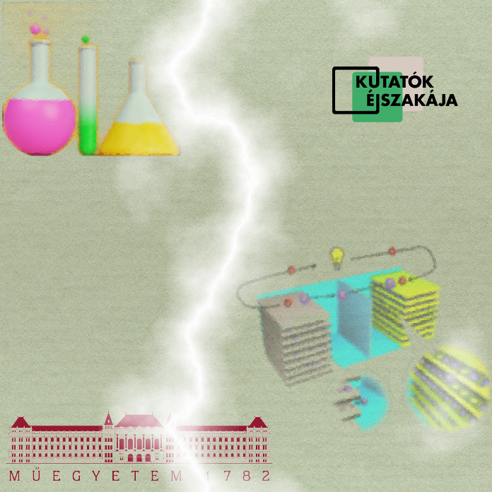

<b>Dr. Höfler Lajos:</b> a BME-n szerezte a PhD fokozatát elektrokémiai rendszerek kísérleti és elméleti vizsgálatából. Posztdoktori kutatóként lehetősége volt két-két évet eltölteni a University of Michiganen és a University of Oxfordon. 2014-ben a kémia tudomány területén egyedüliként megkapta a Junior Prima díjat. Martin Winterkorn által 2012-ben a BME-n alapított Gyurcsányi E. Róbert által vezetett Elektrokémiai Kutatócsoport tagjaként több mint hét éve működik együtt a német Volkswagen AG céggel a Li-ion-akkumulátorok viselkedésének alaposabb megértése céljából. 
  
Az utóbbi évek áttöréseinek köszönhetően ma a zsebünkben hordhatunk olyan eszközöket, amiket nemrég csak sci-fi filmekben láthattunk. Az előadás célja, hogy bepillantást nyújtson a Li-ion-akkumulátorok működésébe, és érthetően áttekintse a technológia lehetőségeit és kihívásait. 
  
 

