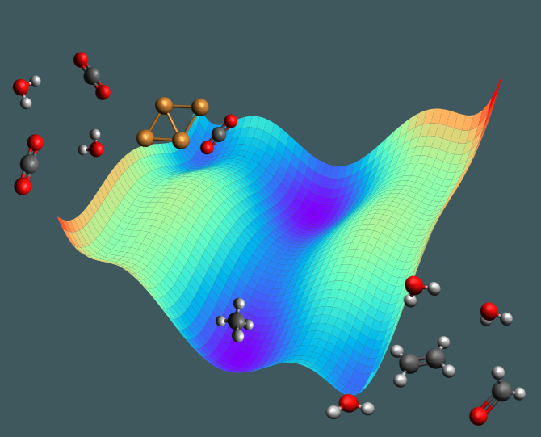

<b> Renata Sechi, Tibor Höltzl:</b> I am Renata Sechi, and I am a PhD student of the <a href="https://www.catchy-etn.eu/)" target="_blank">European program Catchy</a> I am a physicist, and my research is on modelling and computer-simulations of cluster reactions CO2 electro-reduction. 
My supervisor is Dr. Tibor Höltzl, and he is a honorary associate professor at BME and the leader of the Nanomaterials Science group at Furukawa Electric Institute of Technology.
  
<a href="https://www.catchy-etn.eu/" target="_blank">catCHy</a>  
<a href="http://www.feti.hu/" target="_blank">Furukawa Electronic Institute Of Technology Ltd.</a>  
<a href="https://twitter.com/CatchyEtn" target="_blank">Twitter</a> 
  
"Capturing CO2 directly from the atmosphere and converting it into useful fuels is a great opportunity to limit the environmental problems; however, the mechanisms of this process are still under study. 
With this game, we want to explain to you why converting the CO2 to useful chemicals needs advanced routes. Moreover, you will understand what metallic catalysts do and why we use them. 
The game consists in a 3D energy-landscape of a CO2 -reduction reaction, built on a table. Each player pushes a little ball from one side to the other of the table by blowing into a strow.  "

  

