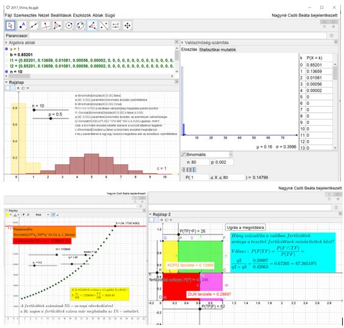

<b>Nagyné Csóti Beáta:</b> mestertanár 34 tanév főként gazdasági ill. műszaki felsőoktatásban. Tanított tantárgyak: Operációkutatás és döntéstámogatás, Statisztika, Gazdasági matematika, Geomatech@Látható matematika, Geomatech@Élményszerű matematika PAT képzések trénere
  
Dinamikus matematikai modellek bemutatása tervezett a programban GeoGebra dinamikus matematikai szoftver segítségével kézzel fogható módon a kézzelfoghatóság elősegítésére. A modelleket főként emelt matematika érettségi feladatokra szerkesztettem, de folyamatok, természeti jelenségek elemzésére vagy térbeli alakzatok matematikai felépítésére is láthatunk szimulációs programot. Öt számítógépen lesz egy-egy matematikai modell GeoGebra appja, amibe az érdeklődők bele tudnak nyúlni: a paramétereket csúszkákkal változtatni, a szerkesztési lépéseket visszajátszani, stb.
  

