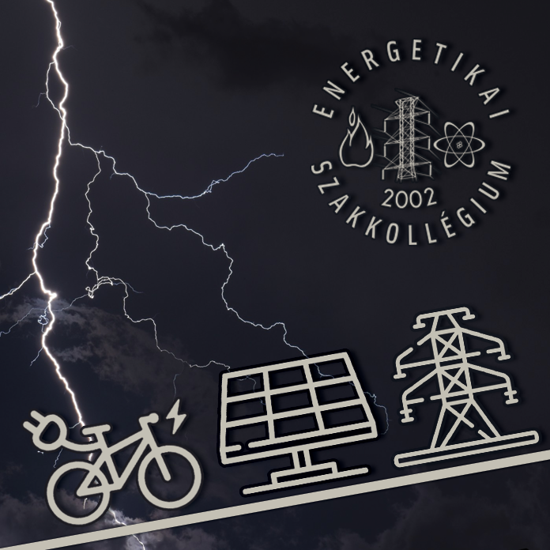

A szeptember 24-25. között megrendezésre kerülő Kutatók Éjszakáján Szakkollégiumunk is részt vesz. Találkozhattok velünk a BME V1 épületének aulájában, beszélgethetünk, mindemellett készülünk pár érdekességgel is, mint például a DIY-HV projektünk, amit a helyszínen meg is tekinthetnek.
  
 

