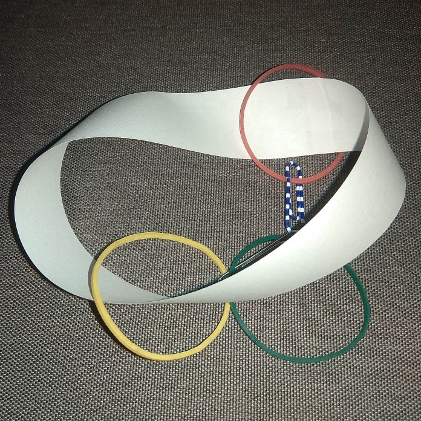

<b>dr. Tasnádi Tamás:</b> Tasnádi Tamás az ELTE-n diplomázott fizikus szakon, itt szerezte meg doktori címét statisztikus fizikából, és pályafutását is az ELTE Fizikai Intézetében kezdte meg. Később érdeklődése fokozatosan a matematika felé fordult, jelenleg a Budapesti Műszaki és Gazdaságtudományi Egyetem Matematikai Intézetében adjunktus. Fizika iránti érdeklődése megmaradt; részt vesz a Nemzetközi Fizikai Diákolimpiára utazó magyar csapat felkészítésében, és kutatási területe is matematikai fizikához kapcsolódik.
  
"Vajon lehet a matematikában kísérletezni?
Az előadáson néhány lélegzetelállító, csaknem bűvészmutatványnak tűnő matematikai kísérletet mutatunk be papírral, gumikarikákkal és gémkapcsokkal. A látogatók maguk is elvégezhetik a produkciókat."
  
 

