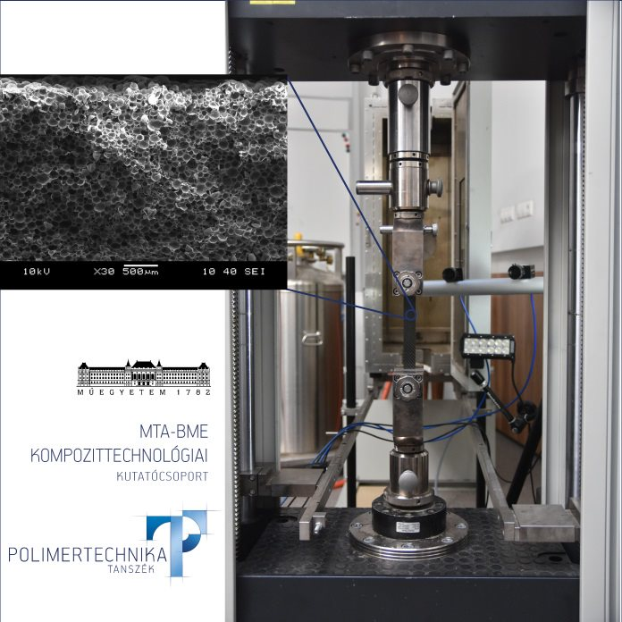

<b><a href="http://www.pt.bme.hu/munkatarsadatlap.php?id=25B9ug9m48B6A987r5q2343q99nw9rb7m3n3qwh2&l=m" target="_blank">Dr. Tamás-Bényei Péter</a></b>
 
<b><a href="http://www.pt.bme.hu/munkatarsadatlap.php?id=m2u96285n263k69972655k9B37gmduggs44fnc47&l=m" target="_blank">Dr. Czél Gergely</a></b>
 
<b><a href="http://www.pt.bme.hu/munkatarsadatlap.php?id=j2j3e454q78eqxmsstuvb3639ho6B799bpp6kbh9&l=m" target="_blank">Dr. Kovács Norbert Krisztián</a></b>
 
<b><a href="http://www.pt.bme.hu/munkatarsadatlap.php?id=Btv9mv8qxj57f62x498x7on36j78d22e4683yf76&l=m" target="_blank">Dr. Suplicz András</a></b>
 
<b><a href="http://www.pt.bme.hu/munkatarsadatlap.php?id=u72B66j398ytkx6k2AB28ro3AhBszbreyr6xhd22&l=m" target="_blank">Hliva Viktor</a></b>
 
<b><a href="http://www.pt.bme.hu/munkatarsadatlap.php?id=6r63636xkp9uw2q5mz69j7qkdr78n8drqs5dufu9&l=m" target="_blank">Magyar Balázs</a></b>
 
<b><a href="http://www.pt.bme.hu/munkatarsadatlap.php?id=e9kcd92p5554gyB78v2x2k5ozf43j45n64B7y29h&l=m" target="_blank">Salvatore Marino Giacomo</a></b>
 
<b><a href="http://www.pt.bme.hu/munkatarsadatlap.php?id=8h6v84sgb4ft76gc23zBh5Aruux9w4B277eh9jhv&l=m" target="_blank">Pomázi Ákos</a></b>
 
<b><a href="http://www.pt.bme.hu/munkatarsadatlap.php?id=3bcc27s959f57wo94y5m8rr9gsy3e66rffr8639c&l=m" target="_blank">Vermes Brúnó</a></b>
 
<b><a href="http://www.pt.bme.hu/munkatarsak.php?l=m" target="_blank">Sántha Péter</a></b>
  
A résztvevők betekintést nyerhetnek a kor legmodernebb anyagainak, a kompozitoknak világába, amelyek egyre nagyobb teret nyernek a high-tech iparágakban (repülőgépipar, űripar) is. Az újrahasznosított szénszálak felhasználásával jelentősen csökkenthető ezen iparág ökológiai lábnyoma.    
  
 

