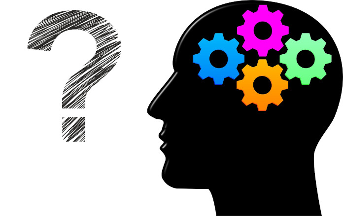

<b>Dobó Dorottya:</b> Az ELKH-BME Lendület Nyelvelsajátítás Kutatócsoport tagja, a BME Kognitív Tudományi Tanszék PhD hallgatója. Érdeklődésének középpontjában a nyelvi- és szociális képességek vizsgálata áll, amit tipikus fejlődésű és különböző fejlődési zavarokkal élő gyerekek és felnőttek körében vizsgál
  
Ki ne gondolt volna már arra, hogy milyen jó volna olvasni mások gondolataiban? Lehetséges, hogy kissé mind gondolatolvasók vagyunk? Honnan tudjuk, mire gondolnak mások, amikor mondanak vagy tesznek valamit? Hogyan fejlődik a tudatelméleti képesség, amely lehetővé teszi, hogy megértsük mások szándékait és vélekedéseit? Milyen módszerekkel vizsgálható ez a képesség, és mi történik, ha a tipikustól eltérően fejlődik? Ezekre a kérdésekre keressük a választ az előadás során.  
  
 

