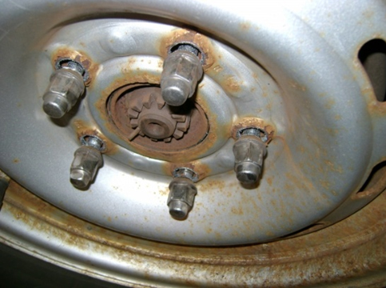

<b>Dr. Lovas László:</b> a BME Közlekedésmérnöki és Járműmérnöki Karán szerzett diplomát járműgépész szakirányon. PhD címét a gépjármű sebességváltók kapcsolhatósága témában szerezte. Jelenleg a BME Vasúti Járművek és Járműrendszeranalízis Tanszék docense. Több éve foglalkozik koponya implantátumok tervezésével.
  
Hazánkban havonta átlagosan két olyan baleset történik, amelynek oka a haszonjármű (busz, teherautó) kerekének elszabadulása. Az előadás foglalkozik a kerékcsavar lelazulás okaival, érzékelhetőségével, valamint a megelőzés lehetőségeivel.
  
 

