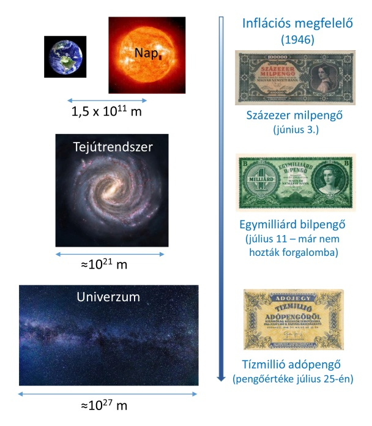

<b>Dr. Danyi Pál:</b> A BME egyetemi docense, árazás szakértő, az ártörténet.hu alapító-szerkesztője
  
Az 1946 májusi-júliusi infláció hazánkban minden elképzelhető méreteket meghaladt. Naponta sokszorosára emelkedtek az árak, egyszerre négy valuta (pengő, adópengő, dollár és arany) forgott a kereskedelemben. Az árak észveszejtő vágtatását a forint 1946. augusztus elsejei bevezetése állította meg, egyik pillanatról a másikra. Az előadás bemutatja a kort, az infláció okait, a mindennapi élet keserűségeit.   
  
 

