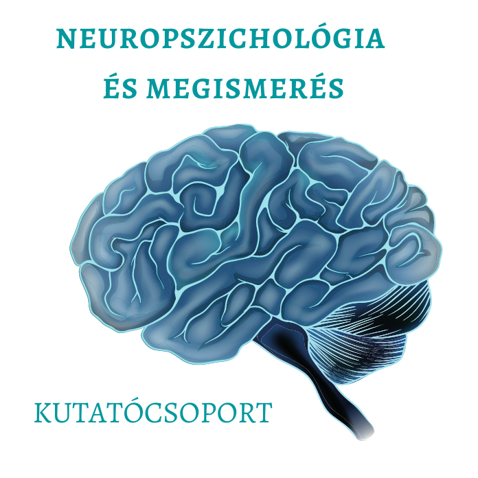

<b>Dr. Demeter Gyula: </b> Demeter Gyula több éve vesz részt neuropszichiátriai és neuropszichológiai kutatásokban és tart kurzusokat különböző neuropszichológia témákban a BME Kognitív Tanszékének oktatójaként.  Neuropszichológusként az OMI-OORI Agysérültek Rehabilitációs Osztályán agysérült betegek rehabilitációjában vesz részt. 
  
Hogyan tudunk emlékezni jövőbeli szándékainkra? Milyen feladatokkal tudja vizsgálni ezt egy pszichológus? Miért van az, hogy valaki rendszeresen elfelejti a tennivalóit, és hogyan befolyásolja mindezt egy agysérülés? Emlékezetünk teszi lehetővé, hogy folyamatosan utazzunk a jelen és a múlt között, és azt is, hogy előre tekintsünk a jövőbe. Demeter Gyula izgalmas előadásában a prospektív memória fő kérdéseibe vezeti be a hallgatóságot, miközben betekintést ad a neuropszichológia rejtélyes világába is. Az előadást mindenkinek ajánljuk, aki szeret rácsodálkozni az emberi agy és emlékezet elképesztően összetett működésére. 
  
 

