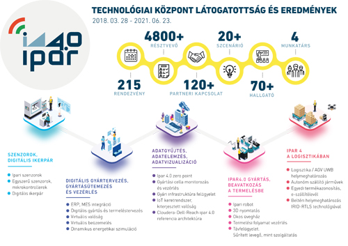

<b>Kovács László:</b> 
1990-ben végzett a BME-n villamosmérnökként, majd 2006-ban szerzett MBA diplomát szintén a BME-n. Szakmai pályafutását a Videotonban kezdte fejlesztőmérnökként, majd a HP tanácsadói csapatába került. 8 évet dolgozott a mobil távközlésben, ebből 4 évet informatikai igazgatóként. Az utóbbi években tanácsadóként, projektvezetőként tevékenykedett hazai és EU-s IT fejlesztési projekteken. Már több éve foglalkozik IoT fejlesztésekkel, ipar 4.0 megoldásokkal. 2018 Március óta a BME Ipar4.0 Technológiai Központ vezetője.

  
A BME ipar4 Technológiai Központban bemutatjuk hogyan beszélnek a gépek egymással, hogyan kontrolláljuk és gyorsítsuk fel a gyrtási folyamatainkat a mesterséges intelligencia alkalmazásával.
  
