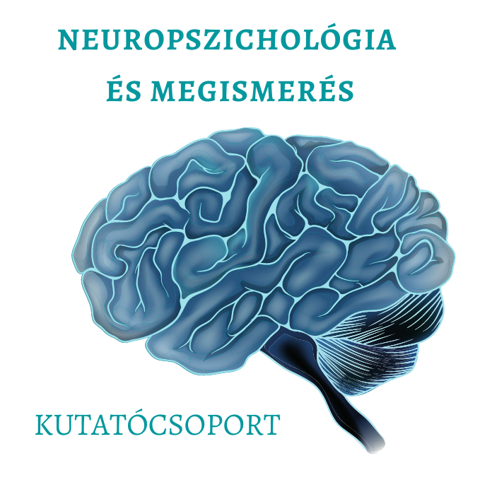

Az előadók a Neuropszichológia és Megismerés kutatócsoport tagjai. A kutatócsoport vezetője <b>Dr. Demeter Gyula</b>, habilitált egyetemi docens és neuropszichológus. <b>Lencsés Anita</b> és <b>Mikula Bernadett</b> pszichológusok és harmadéves doktoranduszok. Érdeklődésük középpontjában az agysérülést követő emlékezeti és társas-érzelmi nehézségek állnak. Fontosnak gondolják, hogy a kutatási eredményeik a neuropszichológiai gyakorlati munkában is alkalmazhatóak legyenek.
  
<b>Demeter Gyula</b> előadásához kapcsolódó laborbemutató, melyben a résztvevőknek lehetősége van saját élményt szerezni a kutatócsoport által használt kísérleti paradigmákkal. Négy fős csoportokban lehet kipróbálni izgalmas számítógépes feladatokat, amelyek a prospektív emlékezeti funkciókat mérik. A kísérletek során kiderül, hogyan is szervezzük meg egy virtuális napunkat, vagy milyen jól tudunk emlékezni érzelemkifejező emberi arcokra és képekre.  
  
 

