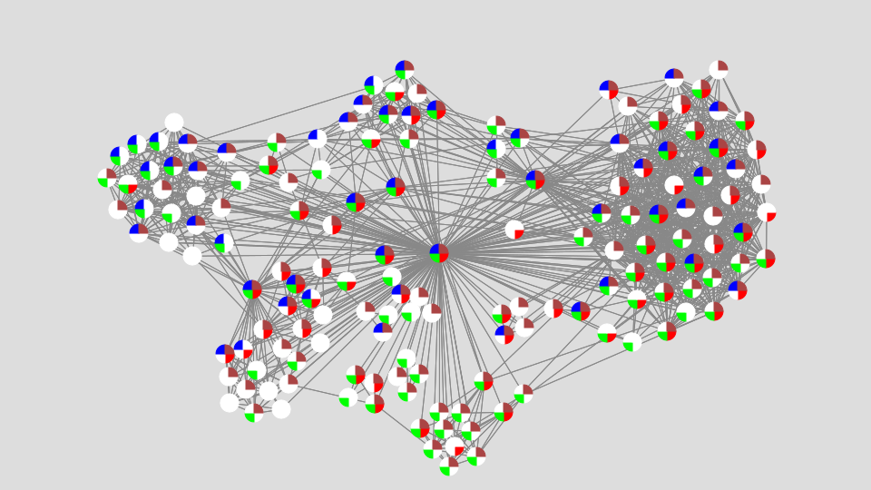

<b><a href="https://dtp.physics.bme.hu/Torok_Janos" target="_blank">Török János</a></b>
  
Miként jönnek létre az emberi kapcsolatok? Hogyan lehet szimulálni egy mesterséges társadalmat? Miként jönnek létre a véleménybuborékok? Miért mások a nők kapcsolatai, mint a férfiakéi? Az előadásban valós adatok alapján, matematikai eszközökkel járunk utána ezeknek a kérdéseknek.    
  

