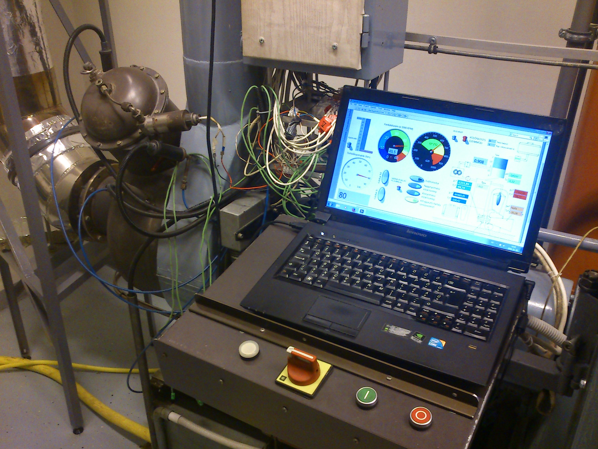

<b>Dr. Beneda Károly:</b> a BME Repüléstudományi és Hajózási Tanszék adjunktusa, kutatási területe a gázturbinás sugárhajtóművek. 2006-ban végzett a Közlekedésmérnöki Karon repülőgépész szakirányon, 2013-ban szerezte PhD fokozatát. Főállása mellett a repülésműszaki oktatásban is tevékenykedik, ahol számos korszerű repülőgép hajtóművét tanítja repülőgép-szerelőknek.
  
<b>Csomor Vilmos:</b> a BME Vasúti Járművek, Repülőgépek és Hajók Tanszékének labortechnikusa, aki a több gázturbinás próbapad létrehozásában, majd üzemeltetésében is kiemelkedő szerepet játszott több mint 25 éves pályafutása során, nemcsak saját Egyetemünkön.
  
A program két fő részből tevődik össze, egy rövid elméleti áttekintéssel kezdődik a korszerű repülőgép-hajtóművek felépítéséről, működéséről, legfontosabb jellemzőikről. Ezután a légcsavaros gázturbinát modellező hajtóművet egy rövidebb üzemelés során működés közben is megfigyelhetik.
  
 

