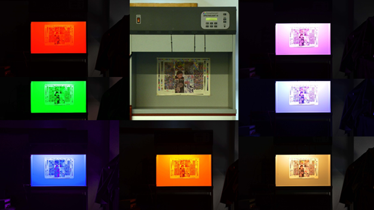

<b>Dr. Nagy Balázs Vince: </b> A Mechatronika, Optika és Gépészeti Informatika Tanszék docense. Kutatási területe a műszaki optika, így a színek fizikája, szubjektív észlelése.

<b>Urbin Ágnes: </b>  a Mechatronika, Optika és Gépészeti Informatika Tanszék tanársegéde. Kutatási területe a színlátás, azon belül a kromatikus adaptáció és hatásai.

Mi a szín? 
Hogyan változik a tárgyak színe különböző környezetekben? 
Mi történik a tárgyak színével, ha színes LED-ek fénye alatt nézzük őket? 
Keressük együtt a válaszokat a MOGI Tanszék optika laborjaiban, ahonnan érdekes kísérletek és vizsgálatok közvetítésével várunk minden kedves érdeklődőt.

 
 

